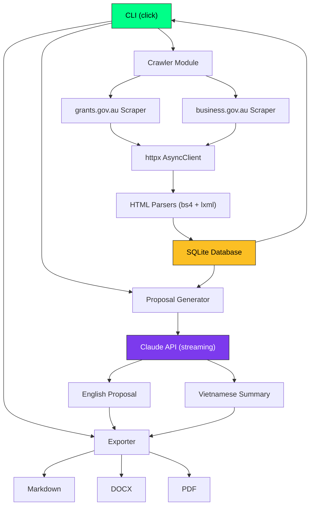

# AU Grants Agent

Autonomous AI agent that crawls Australian Government grant data from live public websites, stores structured data in SQLite, and uses Claude API to auto-generate PhD-level grant proposals (bilingual: English + Vietnamese summary).

## Architecture



## Installation

```bash
# Clone and install
cd au-grants-agent
pip install -e .

# Configure
cp .env.example .env
# Edit .env and add your ANTHROPIC_API_KEY
```

## Quick Start

```bash
# Initialize database
au-grants init

# Crawl grants from all sources
au-grants crawl

# List grants
au-grants list
au-grants list --status open --sort closing_date
au-grants list --closing-soon 30

# Show grant details
au-grants show GRANT_ID

# Generate a proposal
au-grants propose GRANT_ID --org "University of Melbourne" --focus "AI healthcare"

# Full pipeline: crawl → rank → generate
au-grants pipeline --top 5 --format all
```

## CLI Commands

| Command | Description |
|---------|-------------|
| `au-grants init` | Initialize DB + verify API key |
| `au-grants config` | Show current configuration |
| `au-grants crawl` | Crawl all grant sources |
| `au-grants crawl --source grants.gov.au` | Crawl specific source |
| `au-grants crawl --dry-run` | Test crawl without saving |
| `au-grants list` | Rich table of all grants |
| `au-grants list --closing-soon 30` | Grants closing within N days |
| `au-grants show GRANT_ID` | Full grant details panel |
| `au-grants stats` | Summary dashboard |
| `au-grants export-grants --format csv` | Export grants to CSV |
| `au-grants propose GRANT_ID` | Generate proposal |
| `au-grants propose GRANT_ID --format all` | Export as MD + DOCX + PDF |
| `au-grants pipeline --top 5` | Full automated pipeline |

## Configuration (.env)

```env
ANTHROPIC_API_KEY=sk-ant-...
DB_PATH=data/grants.db
CRAWL_DELAY=2.5
LOG_LEVEL=INFO
DEFAULT_MODEL=claude-sonnet-4-20250514
DEFAULT_EXPORT_FORMAT=all
PROPOSALS_DIR=./proposals
```

## Data Sources

- **grants.gov.au** — Official Australian Government GrantConnect registry
- **business.gov.au** — Business grants and programs listing

## Proposal Output

Each proposal includes:
1. Project Title & Executive Summary
2. Background & Significance (Australian context)
3. Research Questions & Objectives
4. Methodology & Research Design
5. Expected Outcomes & National Benefit
6. Work Plan & Milestones
7. Budget Justification
8. Team & Institutional Capability
9. Risk Assessment & Mitigation
10. References
11. **Tóm tắt Tiếng Việt** (Vietnamese summary)

### Export Formats
- **Markdown** — With YAML frontmatter
- **DOCX** — Professional formatting, title page, page numbers
- **PDF** — Clean layout with Vietnamese Unicode support

### File Naming
```
proposals/
  2026-03-05/
    GO7891_CRC_Program_20260305.md
    GO7891_CRC_Program_20260305.docx
    GO7891_CRC_Program_20260305.pdf
```

## Tech Stack

- Python 3.11+
- httpx (async HTTP)
- BeautifulSoup4 + lxml (HTML parsing)
- SQLite (database)
- Anthropic SDK (Claude API streaming)
- Rich (terminal UI)
- Click (CLI)
- Pydantic (data models)
- python-docx (DOCX export)
- fpdf2 (PDF export)

## Notes

- Live crawling is the primary mode — no mock data
- Rate limited: 1 request per 2.5 seconds by default
- Respects website structure changes with graceful error handling
- Vietnamese summaries are written naturally, not machine-translated
- PDF Vietnamese Unicode: uses DejaVu fonts if available, falls back to latin-1 encoding
